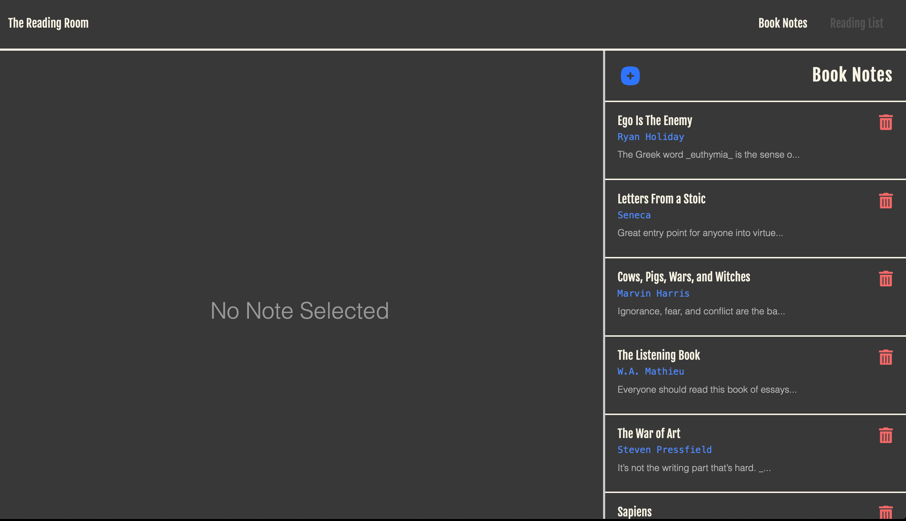
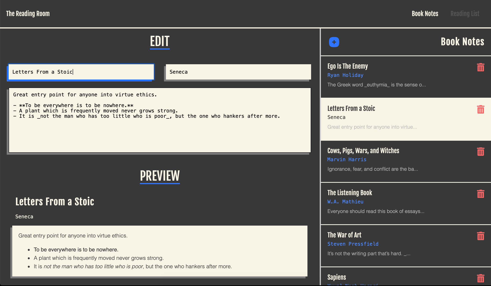
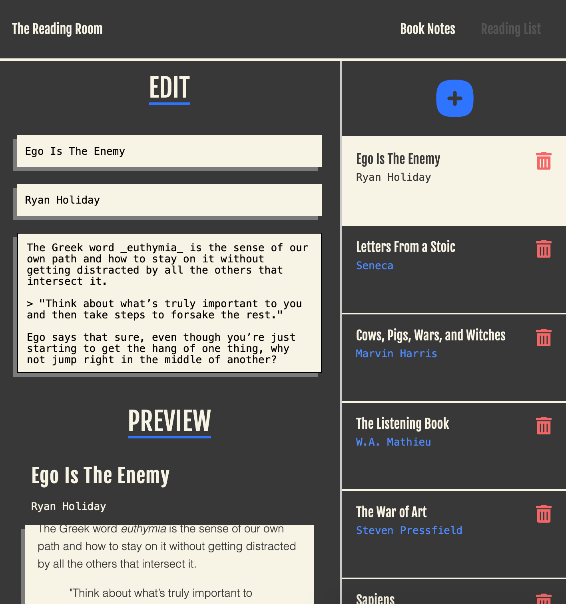

<div align="center">

<h1 align="center">Book Notes (The Reading Room)</h1>

  <p align="center">
    A web application to make and save notes on books you've read, and keep track of books you'd like to read. Built with React.
    <br />

<a href="https://agia.github.io/Book-Notes/"><strong>View Demo</strong></a>
<strong>||</strong>
    <a href="https://github.com/Agia/Book-Notes/issues">Report Bug</a>
    <strong>||</strong>
    <a href="https://github.com/Agia/Book-Notes/issues">Request Feature</a>
  </p>

  
</div>

<br />

## Table of Contents
<details>
  <summary><strong>Click to Expand TOC...</strong></summary>
  <ol>
    <li>
      <a href="#description">Description</a>
      <ul>
        <li><a href="#built-using">Built Using</a></li>
      </ul>
    </li>
    <li>
      <a href="#getting-started">Getting Started</a>
      <ul>
        <li><a href="#prerequisites">Prerequisites</a></li>
        <li><a href="#installation">Installation</a></li>
      </ul>
    </li>
    <li><a href="#usage">Usage</a></li>
    <li><a href="#license">License</a></li>
    <li><a href="#acknowledgments">Acknowledgments</a></li>
  </ol>
</details>
<br />
<hr />

## Description

A self-contained and functioning app, which was created as a part intended for the project repo [The Reading Room](https://github.com/Agia/The-Reading-Room), which is a single page web app that allows a user to save notes on books they have read, and retrieve them for review or editing later.

Users can also add to a reading list to keep track of books they would like to read, and review that list.

<br>

> :exclamation::exclamation: **Important** :exclamation::exclamation:
> 
> Currently, this repo contains the `**Book Notes**` part of `The Reading Room` app, but not the `Home` page and `Reading List` components. Whereas `The Reading Room` repo, linked above, doesn't contain a `Book Notes` function, nor are the two repos compatible at this time, either functionally or stylistically, having been created entirely separately.

<br>

**_The app in this repo deals with all aspects of the Book Notes functionality, and runs as a self-contained app, with a separate home page, and working links._**


<p align="right">(<a href="#readme-top">back to top</a>)</p>

### Built Using

<br>


<br>

## Getting Started

If you'd like to view the live version, you can follow [**this link**](https://agia.github.io/Book-Notes/).

To get a local copy up and running follow the steps outlined below.

### Prerequisites

You'll need to have Node.js `18.x` (or higher) installed on your system (you can visit the [Node.js website](https://nodejs.org/en/) for instructions on installing Node).


### Installation

1. With Node installed, you can clone the repo to your local system, for example, by running:
    ```sh
    git clone git@github.com:Agia/Book-Notes.git
    ```
2. Navigate into the repo directory on your local system, and install the required NPM packages by running the following command:
    ```sh
    npm i
    ```
3. You're all set!

<p align="right">(<a href="#table-of-contents">back to top</a>)</p>

<hr/>

## Usage

- Open your command-line, and navigate to the parent folder of the repo (it will contain `index.js`).
- Enter the following into your command-line:
    ```sh
    node start
    ```
- The web application will open locally in your default browser (default `http://localhost:3000/`)
- You're good to go!

### Screenshots

- The screenshot below demonstrates the book notes web application in on initial page view.


- The screenshot below demonstrates the book notes web application in active use.


- The screenshot below demonstrates the book notes web application, in active use, at a mobile screen size.


<hr/>
<br/>

## License


Distributed under the MIT License.

<p align="right">(<a href="#table-of-contents">back to top</a>)</p>

<br/>

## Acknowledgments

* [StackOverflow](https://stackoverflow.com) for many things.
* Documentation for [React-Markdown](https://remarkjs.github.io/react-markdown/), [nanoid](https://github.com/ai/nanoid), and [React](https://react.dev).
* [The Internet](https://duckduckgo.com) for solving many, errors and providing many tips.

<p align="right">(<a href="#table-of-contents">back to top</a>)</p>